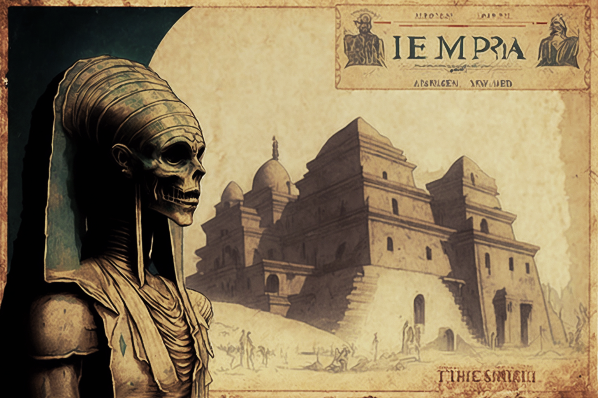

# From among the dead

<figure><figcaption></figcaption></figure>

### **The gestation of the Khepris**

It was rumored that not only the aforementioned allegorical sculpture was saved from the fire on New Year's Eve 1922, but also that gear machinery whose movement never ceased. Steiner managed to save it and put it in a safe place in an unknown location. However, after his death, and with time, the legend spread that the mechanical contraption had been buried somewhere in the necropolis of Tuna el-Yebel (Hermopolis Magna of the New Empire of Ancient Egypt), near the Tomb of Petosiris, in whose catacombs there is a sober representation of Osiris-Khepri in bas-relief form.

<figure><figcaption></figcaption></figure>

Its constant activity, over a hundred years, would have created a magical field of energy, from which the first Khepris, who would become guardians and symbols of the city of Veel-Tark, were born; When in 2021 the Oracles carried out the ritual, on the same ruins of Tuna el-Yebel, to open a space-time gap that would connect them with the disappeared city of Veel-Tark, they found in the catacombs of the tomb of Petosiris an astonishing colony of 55 Khepris, who would be known, from then on, as the _**Primordials**_.
