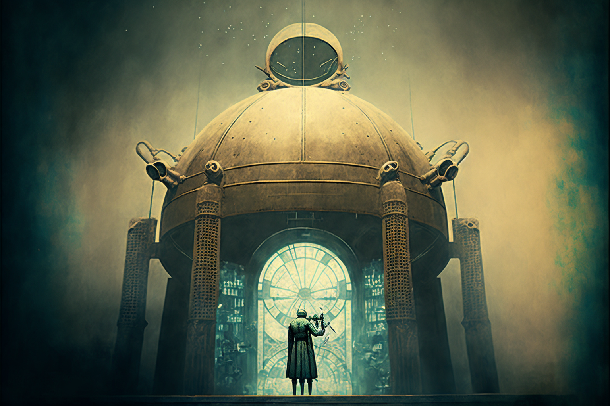

# The cosmos machine

<figure><figcaption></figcaption></figure>

### **As above, so below**

Considering the impact this writing must have had on Rudolf Steiner's work, part of which was the project for the virtual city of Veel-Tark, a model of which rested in the Goetheanum in Dornach (Switzerland), it is not difficult to understand the great importance of the Egyptian deity Khepri in this project. Its transformative meaning, its rebirth and its elevation from the waste were revelatory for the Austrian thinker.

<figure><figcaption></figcaption></figure>

Supposedly, Steiner had a small-sized reproduction of the gear machinery described by Athanasius in his manuscript built, which was included in the Veel-Tark model itself. This machinery then came to represent the heart of the city; a mechanical dung beetle of tiny size was inserted into the wheel of the athanor to exercise motion with the accumulating action of its front legs, causing the geared apparatus to rotate constantly, day and night, driven by its own kinetic energy. The whole dynamic of the enormous and complex structure of Veel-Tark depended, then, on the activity of a tiny being.
