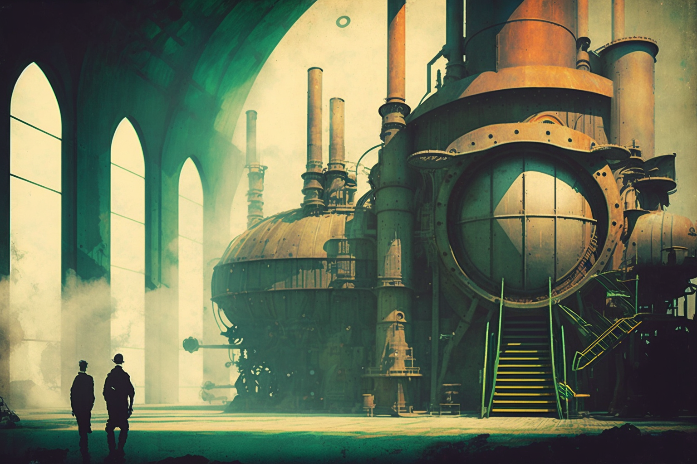

# Preface

<figure><figcaption></figcaption></figure>

### The Awakening Of A New Era

The Second Industrial Revolution brought with it the engine of progress, arising new disciplines related to technology and scientific knowledge; it was also accompanied by major contributions in the fields of philosophy, psychology, etc., as well as innovative artistic currents.

This change of paradigm in society fuelled the proliferation of secret societies, which sought a source of primordial knowledge, a source of infinite knowledge. A source, in short, of higher power. This quest for power was on the agenda of all secret societies, even if it were for the common good or for hidden interests.
