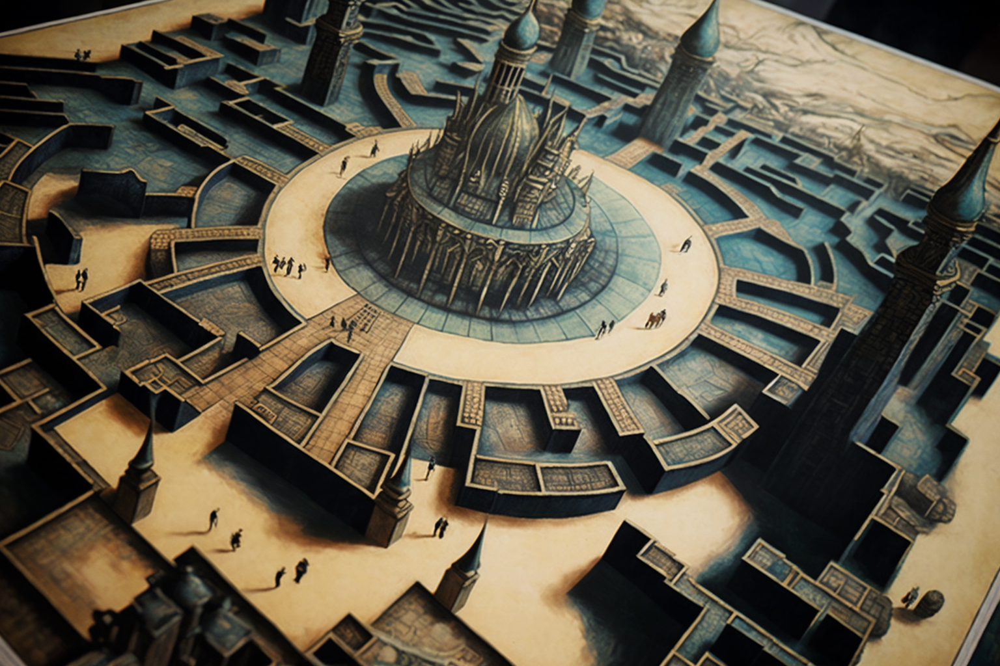

# The Creation Of The Game

<figure><figcaption></figcaption></figure>

### The Five Initiates&#x20;

Thus was born what they would begin to know, in a nod to the hermetic codes, as "the game". In the year 1921, the great game board, the mythical city of Veel-Tark, was born in the hands of five initiates.&#x20;

These five initiates were Rudolf Steiner (representing Anthroposophy), Annie Besant (representing the Theosophical Society), Theodor Reuss (representing the Ordo Templi Orientis), William W. Atkinson (representing New Thought) and Alice Bailey (representing the Lucis Trust). The five initiates established thirteen principles which they considered an unfading code of conduct: Gratitude, Self-awareness, Responsibility, Optimism, Empathy, Kindness, Tenacity, Curiosity, Patience, Conviction, Humility, Ambition, Honesty.&#x20;
