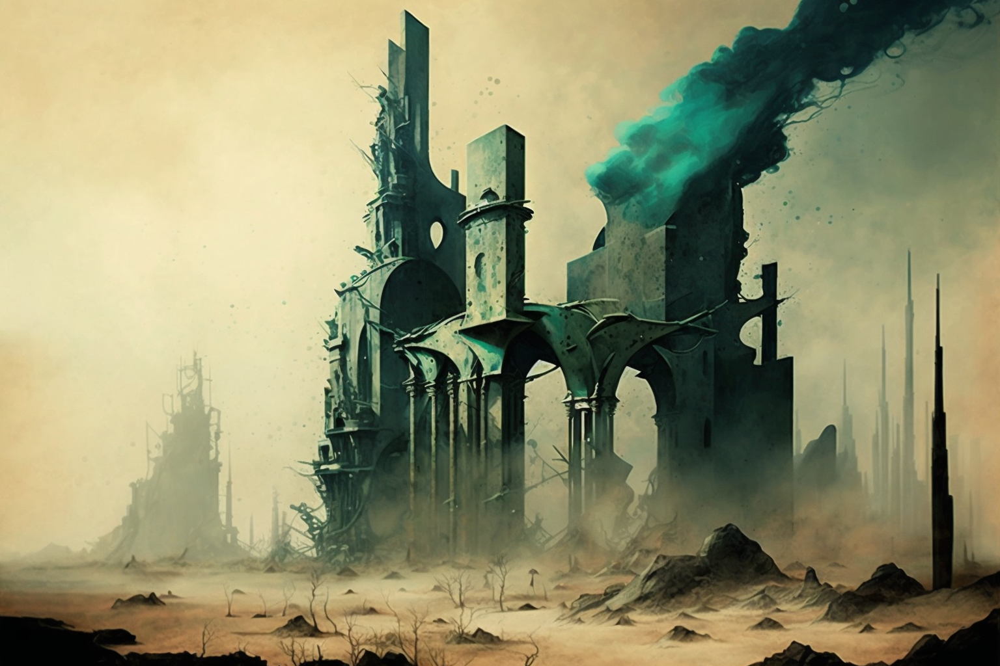

# The Fall

<figure><figcaption></figcaption></figure>

### Shadow Societies

Two of the most prominent citizens, Aleister Crowley (Thelema Society) and Rudolf von Sebottendorf (Thule Society), with their powers of persuasion, rebelled against the work of the initiates, whom they began to brand as oligarchs, accusing them of hiding valuable secrets and knowledge to be wielded at will.

The five initiates removed the powers and citizen cards of the two occultists. Societies like Crowley's and Sebottendorf's, founded on selfishness and lack of values, were stigmatised.

A dark seed had germinated in the city, slowly growing among the citizens. Thus, on 31 December 1922, the Goetheanum building of the Anthroposophical Society burned to the ground in an arson attack. Those responsible were not found, but the flames reduced every corner of the great city to ashes, taking with it every vestige of the great project that the five initiates had enlightened.&#x20;
