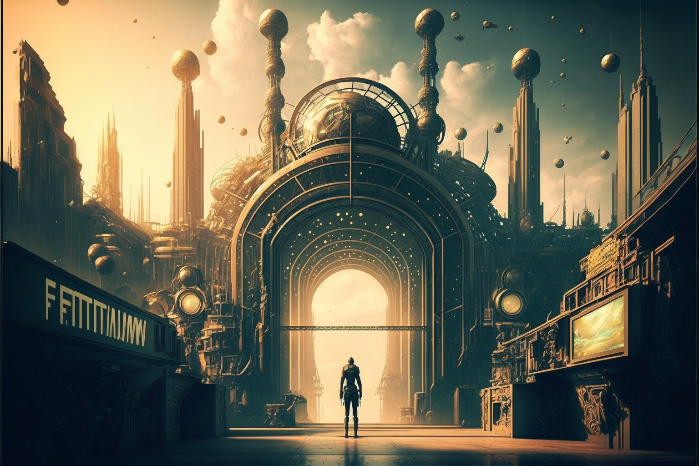

# The Rebirth

<figure><figcaption></figcaption></figure>

### The Conjunction of the Oracles

A hundred years had to pass, since its first creation, for the name Veel-Tark to be pronounced again.

In the year 2021, under the turbulent currents of the Third Industrial Revolution, within the framework of a new technological paradigm, a group of Oracles recover the old ideas of the five initiates, beginning to forge the rebirth of the city of Veel-Tark. Gathered in the vicinity of the necropolis of Tuna el-Yebel, they open a space-time rift in order to find the city-state: the huge game board that was devoured by flames on New Year's Eve 1922, on which the model of Veel-Tark was laid out.

The Oracles connected with the Akashic Records, which occupy what Theosophy and Anthroposophy call the mental plane. There they found the necropolis of Veel-Tark. Repopulating it and bringing it back to life was going to be an arduous task. They had to attract a large number of guilds and form new factions of knowledge to do so....

