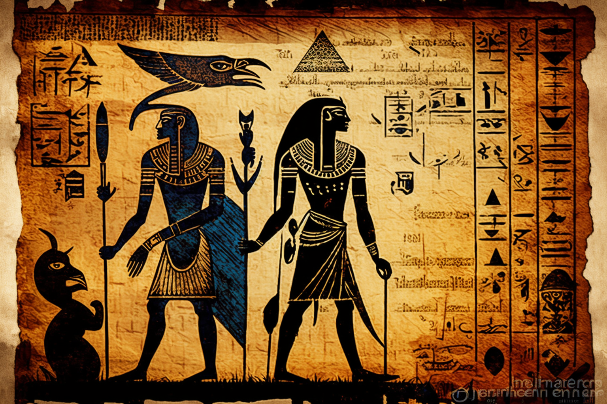

# Khepri and the dead

<figure><figcaption></figcaption></figure>

### **The watchmaker of the cosmos**

Let us return to our dung beetle inside the athanor, spinning the wheel to infinity; in ancient Egypt, the dung beetle represented in the hieroglyphs took the name of Khepri, phonetically **Jepri**, acquiring a priestly character. Jepri was, like the beetle that creates the form from its ball of waste (and whose eggs hatch in the carrion), the dispenser of life and the symbol of transformation, of rebirth, of the cycle of death and resurrection. We see clear coincidences with the connotations that the Kabbalah offers to the number 7. Our dung beetle eternally moving the wheel of the athanor also represents universality. From this vision, there is a version of Jepri that takes a paradigmatic position: the dung beetle spinning the solar disk as the foundation of the universe. In this variant, Jepri makes Osiris spin, suggesting, at the same time, the dawn and the sunset, the beginning and the end. Then, the scarab took a deific form, which was related to the aforementioned solar deity, Osiris. Represented in this way we can find it in different places, such as the last sequence of the _Book of Doors_ (sarcophagus of Pharaoh Seti I) or in the tomb of Petosiris (necropolis of Tuna el-Yebel); or mentioned in different texts, such as the _Book of the Dead_, under the name of **Osiris-Jepri** (prayer 154 of the _Book of the Dead_). Neither more nor less than our watchmaker of the cosmos. As we verify with our artifact, life is born from chaos**.**

<figure><figcaption></figcaption></figure>

Just to satisfy the magic of synchronicity, or the divine nature of numbers, given, according to the Kabbalah, to men by the gods, let us return to numerology and submit this watchmaker of the cosmos, Osiris-Jepri, to the calculation of gematria, Hebrew discipline to designate the combination of the letters of a word and thus understand its numerical value. There are different conversion methods based on the correspondences between the Hebrew and Latin alphabets, from those originally developed by the Kabbalah to the one used by the Pythagoreans, but the oldest is that of Chaldean-Hebrew numerology:

<figure><figcaption></figcaption></figure>

The 9 does not appear in this conversion, since, on the one hand, it is the sacred number, and, on the other hand, the Hebrew letters that have that value have no equivalence in our alphabet. As we have said, there are other conversion systems, but this is the one that offers more reliability because it is the oldest and the one most studied by the most reputable cabalists and occultists, such as Cagliostro himself.

To find the number that corresponds to a verb sign, we must transpose the letters of the name to the numbers, and from the result obtained reduce the digits as we did previously with the gears of our contraption. _Osiris Jepri_, thus offers us this result:

731213   15821

Now we proceed to the numerological synthesis, as we already know: adding up all the digits and reducing them to obtain a single digit:

7+3+1+2+1+3+1+5+8+2+1=34          3+4=7

Either:

7+3+1+2+1+3=17   1+5+8+2+1=17          1+7=8   1+7=8          8+8=16          1+6=7

Thanks to numerological wisdom, from the mythology of Egypt and the Kabbalah, we can ratify that the nature of our watchmaker of the cosmos also contains universality, the same of the number 7, the same that moves our cogwheel contraption. We can even affirm that our beetle is not only the watchmaker of the cosmos; it is, above all, the one that certifies the succession of all the universal cycles, the one that renews life, the one that constitutes creation and rebirth. It is, then, the very builder of the universe.
