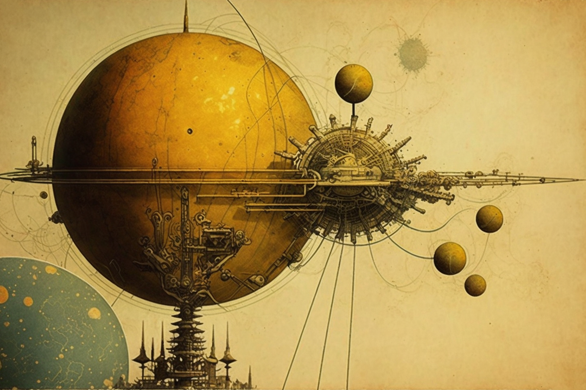

# The cogwheels of chaos

<figure><figcaption></figcaption></figure>

### **Emulating Antikythera**

If we then devise a mechanistic system to explain the logic of this movement in the cosmos, we can find an eccentric relation between its chaotic movement and the regularity that ends up being adjusted on the theoretical plane.

Our references are the cogwheel contraptions, so popular among ancient Greek thinkers (such as the mechanism found on the Greek island of Antikythera, probably from 150 B.C.), which tried to explain evolutionary motion, where natural elements are subject to predetermined parameters based on the number of teeth that each wheel has, the perimeters, radiuses and diameters, the position they occupy and the analogy in rotary motion.

Our own cogwheel contraption bases its system on the relationship between what is above and what is below (which, as we have pointed out, present analogous cosmic movements according to the Hermetic vision, ratified by new geometric proposals such as the aforementioned Koch curve); microcosm and macrocosm will form the two main wheels of our gear, moved by a third wheel, which we will call atanor, a name we give it because of its function as a link between both worlds (like the alchemical bowl, where the universal consciousness was cooked). The atanor wheel will then connect the wheel of the microcosm with the wheel of the macrocosm, agitating the movement of both.

The functioning of our contraption is delimited by the difference between the number of teeth of each wheel. To assign these numbers of teeth we will resort to numerology, seeking to start from the universal number; from the primary, absolute number, from the number that represents the essential universality. The numerology of the Kabbalah advocates, as Helena Blavatsky reminds us, that numbers were revealed to men by the gods, and that these numbers, converted into music, made the world emerge from chaos. For the Kabbalah, then, 9 is the sacred number, and there is only one other number above it in terms of the power it possesses: the number 7, the bridge between the divine and the human, between heaven and earth, between spirit and matter, since it is the sum of the sacred 3 and the earthly 4. 7 is, moreover, according to Hippocrates, the dispenser of life and the motor of all transformations. We will explain this character and its relation to our device later, but it is undoubtedly the number that represents that universal synthesis from which we must start**.**

<figure><figcaption></figcaption></figure>

To the wheel of the microcosm we offer, then, 7 teeth. Now, to mark the increment, we look for a chaotic stimulant that simulates the irregularity of cosmic motion; thus, we select the formula 2x²-1, an equation that, when iterated, produces chaos in a way that is as inevitable as it is unpredictable, a phenomenon that can be observed in Dalton's adding and listing machine after a certain number of operations and iterations. Thus, 2x²-1 when x=7, yields 97 as a result. We find ourselves with a numerological curiosity, when we submit the number 7 to the formula of chaos; the universal synthesis reappears, preceded by the number 9, the sacred number according to the Kabbalah. Now, we look for the numerological synthesis of the number of teeth of the atanor wheel, with the reduction of its digits: 9+7=16; 1+6=**7**. Surprisingly, the number of the teeth of the reduced atanor again offers us universality. But we move on. Now, we carry out the increment to find the number of teeth of the wheel of the macrocosm, for which we submit the number of teeth of the athanor to the same formula: 2x²-1, when x=97. The result is 18817. New curiosity; the universal number, 7, preceded by a capicua number, composed of two suggestions of the number 9, the sacred number (which already preceded the number 7 in the athanor): 18 and 81. 18=9+9, and 81=9X9. Moreover, in the numerological synthesis, 1+8=9 and 8+1=9. Obviously, 1881, reduced, is equivalent to 9. But let us solve the reduction of the digits of the number of teeth of the macrocosm to the whole: 1+8+8+8+1+7=25; and 2+5=**7**. Once again, the reduced number of teeth gives us universality.

We already have our contraption, composed of three wheels representing the movement of the cosmos; microcosm, athanor and macrocosm, whose wheel numbers (7, 97 and 18817 respectively), found through a mathematical formula that produces chaos (in the form of unpredictable iterations), are shown to be completely analogous and end up leading, through numerological synthesis, to the same point.

&#x20;Now, let us observe their perimeters, taking any measurements for the teeth and the interstitial spaces between them, since the behavior of their relationship will not vary with respect to this convention. Let us imagine that each tooth measures 2 cm, and another 2 cm the space between each tooth. Thus, the microcosm wheel has 7 teeth and 6 spaces, which makes its perimeter 26 cm. Reducing its digits: 2+6=**8**. The number between 7 and 9, which as we have seen mark exclusively the number of teeth of each wheel. For the atanor, which has 97 teeth and 96 spaces, we obtain a perimeter of 386 cm. By reducing the digits: 3+8+6=17; and 1+7=**8**. And, for the macrocosm, which has 18817 teeth, and 18816 spaces, the perimeter is 75266 cm, which in the reduction of its digits: 7+5+2+6+6=26; and 2+6=**8**. The syntheses of the three perimeters lead back to the same point: the number **8**.

But the real critical behavior of the gearing occurs in the dynamics of the wheels and the comparative aspect between the number of turns they make; let us imagine that we place in the center of the athanor a mechanism with the shape and behavior of a dung beetle, and that this mechanism rotates the wheel indefinitely connected to the kinetic movement of the wheels themselves, in a feedback system. We begin with the motion of the athanor wheel, as the principle of the dynamics between the microcosm and the macrocosm. For the atanor to complete a full turn, the microcosm must complete 13'857143 turns, while the macrocosm completes a minimum fraction of a full turn: 0'00515491. Our system goes into chaos, the numbers are destabilized and are no longer integers. But this is logical, being our referent to the atanor. What interests us is to check the relationship between the microcosm and the macrocosm. Let us take the major as a referent to save time.

<figure><figcaption></figcaption></figure>

When the macrocosm has completed an entire revolution, the athanor has completed 193'98969, and since the microcosm completes 13'857143 revolutions for each one of the athanor, for one revolution of the macrocosm it completes 2688'14287. Unstable figures that do not present analogous pictures. For 2 turns of the macrocosm, the microcosm realizes 5376'2857, and the atanor 387'97938. New decimal figures that demonstrate an increasing instability. Is it, therefore, an arithmetically unbalanced relation that of the microcosm and the macrocosm? Does the cosmic and evolutionary dynamics behave in a disorderly way, without patterns or analogies? It is then that we tend to think of a chaotic behavior of the dynamics of the universe. But we are not finished...

For 3 turns of the macrocosm, the microcosm makes 8064'4286 turns, and the atanor 581'96907 turns. The figures remain unstable, without fulfilling orders of any kind. We assume that the instability will increase with the number of turns (there is a relationship between the space traveled and the time elapsed). The relationship between one wheel and another, and its inseparable link with the linking disk, are tinged with rough spots and indeterminisms. There seems to be no order or globality, and so far it is impossible for us to establish a periodic linearity.

But, what happens if we make a small jump, and we observe the results when the macrocosm completes **7** turns? The atanor has made 1357.9278 turns, but with the microcosm logic shows us a spectacular behavior, since the wheel of the microcosm is contained x times in the wheel of the macrocosm, and both are connected by this mathematical relation: its dynamics becomes stable, the number of turns it makes is integer, and it is none other than **18817**. When the number of turns of the macrocosm is equivalent to the number of teeth of the microcosm, the number of turns of the microcosm is equivalent to the number of teeth of the macrocosm. And both return in the synthesis, as much with respect to the number of teeth as with respect to the number of turns, to universality, to the number **7**.

In this inversion of values, the idea of the opposite trajectory of the evolution of the universe, advancing towards its own reflection, is manifested. But what happens after this stationary state of stability? The system is destabilized again (for 8 turns of the macrocosm, we have 21505,143 of the microcosm, and 1551,9175 of the atanor). Thus, order and chaos seem to intertwine in a game of equilibrium and imbalance. For we sense that, if the dynamics has stabilized at a particular point, it will do so again, leaving aside the coincidence of an isolated event to mark a regular pattern. Obviously, it does so again when the macrocosm completes 14 turns; the atanor has made 2715.8557 turns, and the microcosm 37634, again a whole number. The numerological particularity that we observe from this moment on is that the decomposed sums of the digits of the turns of the macrocosm and the microcosm each time they stabilize, moreover, coincide (14: 1+4=**5**. At the same time, 37634: 3+7+6+3+4=23; and 2+3=**5**). Thus, when the macrocosm completes 21 turns (2+1=3), the atanor makes 4073.7835 turns, and the microcosm 56451 (5+6+4+5+1=21; 2+1=**3**). When the macrocosm completes 28 turns (2+8=10, and 1+0=1), the atanor completes 5431.7113 turns, and the microcosm completes 75268 (7+5+2+6+8=28; and 2+8=10; and 1+0=**1**). The patterns are found in the numerical successions; the system stabilizes every 7 turns (universality), and the syntheses of the numbers descend with every 7 turns by 2 in 2 (7, 5, 3, 1. And if we reduce the digits of this series: 7+5+3+1=16; and 1+6=**7**; once again universality). This is our regularity for the chaotic functioning of the universe.

It is not difficult to intuit, behind this pattern, new disorders and new patterns not yet glimpsed, tending towards infinity. But the fundamental behavior is that the athanor, which moves both worlds, which offers this pattern of order for their movement, which has granted us regularity, never stabilizes in synchronicity with the microcosm and the macrocosm. It reveals itself as a chaotic origin, awakening a probabilistic and regular cosmic structure at the same time, where accidents, far from being a casual effect, represent on the contrary and irrefutably the purest effect of a cause.
