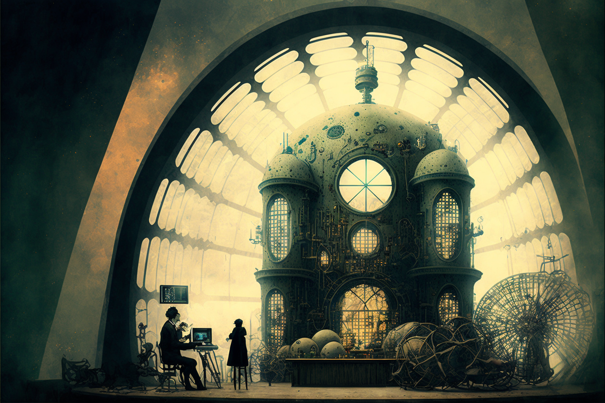
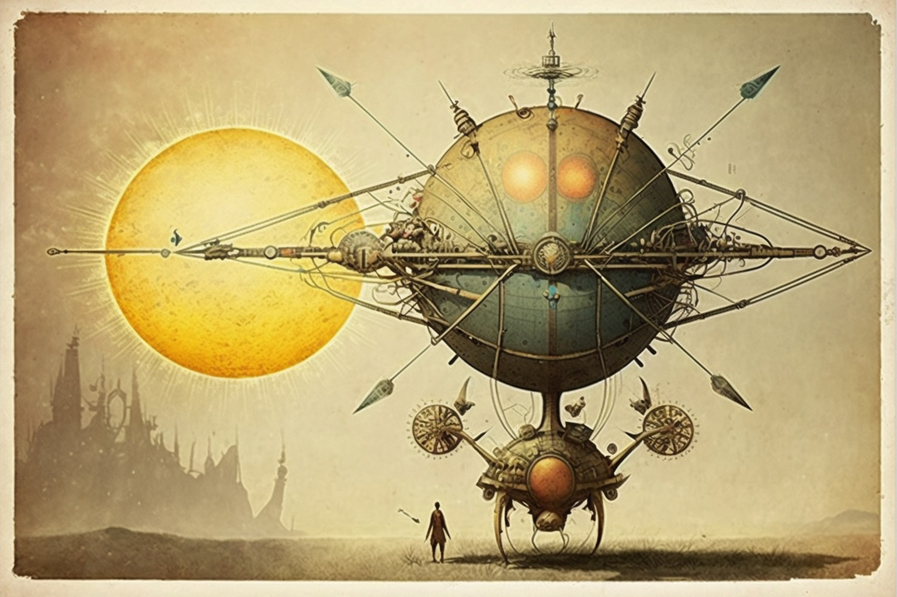

# The Tohu va-Bohu

<figure><figcaption></figcaption></figure>

### **The movement of the universe**

Nineteenth-century mechanicists, influenced by Laplace's determinism, were convinced that knowing the origin and trajectory of a celestial body could unequivocally predict its destiny. Thus, the universe moved, for them, in a linear and regular way, governed by a cosmic clockmaker of absolute precision.

However, the appearance of Max Planck's quantum mechanics and Poincaré's mathematics of chaos overthrew this reassuring approach, uncovering irregularities in all semblance of order and dangerous relative errors in dynamic systems; lurid points which, under the action of that randomness which is but the measure of human ignorance, amplify violently until the whole structure is broken down. But, in spite of the initial terror that all his theories seem to arouse, in reality they tend to show that perturbations only partially destroy regularity. They introduce turbulence and chaos, but constitute, from another perspective, a form of order. Somehow, there is an eagerness to find a new structure under the chaotic movement, to find its regularity, even if it is only a stationary state tending to instability.

<figure><figcaption></figcaption></figure>

It happens that in the first stage of nature there is a curious antinomy between that which becomes and that which remains; under all dynamics, there is something that tends to disappear and something that reveals itself to be immutable, bringing together the discourses of Heraclitus and Parmenides. In this way, science meets again with philosophy. Each movement incites its successive one to form itself in an unrepeatable way, but, in the globality, all movements seek the same attracting point, like a funnel in which two drops of water, which never trace an exact path, nevertheless end up by flowing into the same channel (the mouth of the funnel). In the great funnel of the cosmos (the universal attractor), all the unpredictable possibilities tending to infinity are produced. Thus, the calculation of any energy in motion is inevitably subject to the relationship between regularity and indeterminism, since we discover in the dynamics of this energy continuous unpredictable variables that end up amplifying in an uncontrolled way, yielding unexpected results within a graph, however, regular and analogous in its iteration.

<figure><figcaption></figcaption></figure>

In other words, and as Poincaré has observed, on a large scale all perturbations tend to stabilize, revealing analogous behaviors with small-scale phenomena, a proposition that is also observable in the Koch curve. Thus, the new science, walking hand in hand with esotericism, comes only to express the same analogous relations that Hermes Trismegistus observed, more than two thousand years ago, between the microcosm and the macrocosm: _as above, so below_.
