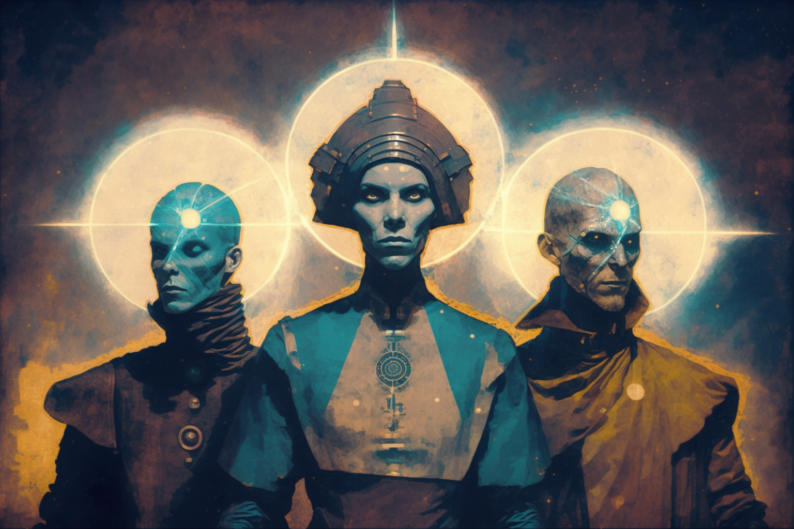

# THE FACTIONS

<figure><figcaption></figcaption></figure>

The four factions were developed for the study and dissemination of the different fields of development: Gamification, Education, Framework and Arts, and are the main groupings of Veel-Tark. They possess, by their nature, specific identities and interests. Thus, each faction has its own objectives and its own wealth of knowledge. The collaborative spirit and the meeting between factions is essential for the integrity of each of the fields of development, as well as for the growth of the community of citizens as a whole.
