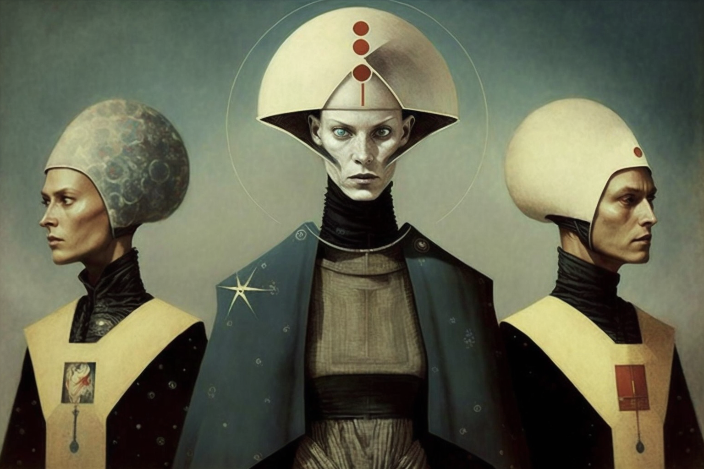

# THE GUILDS

<figure><figcaption></figcaption></figure>

The Guilds are the most significant groupings in Veel-Tark, as they clearly define the roles and skills of each citizen. Each guild is a group made up of different specialities, encompassing all the occupations that come together in the city.
