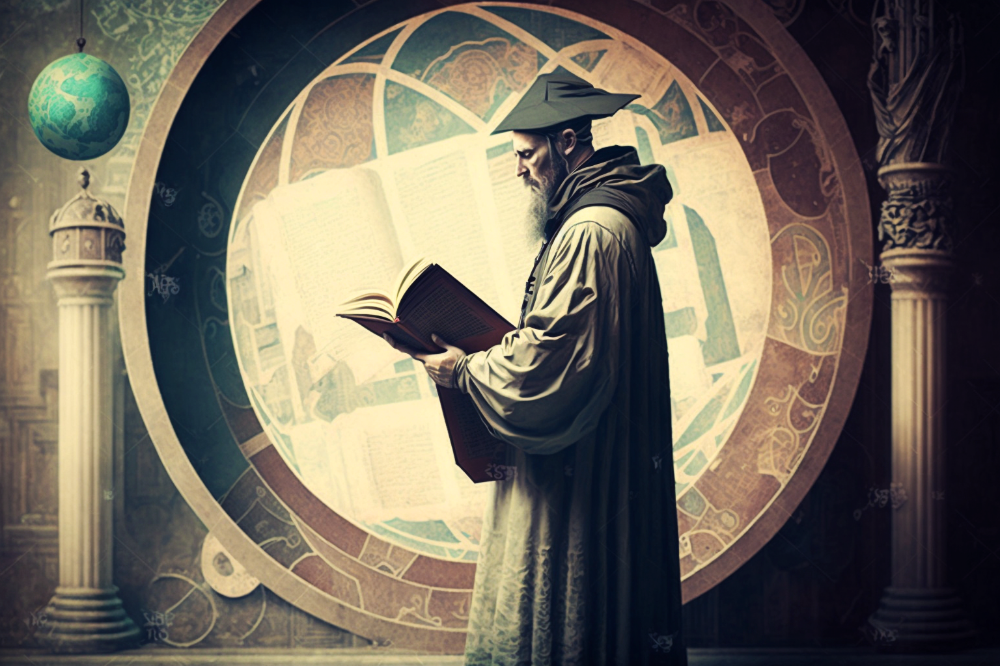

# Exegetes

<figure><figcaption></figcaption></figure>

Those who make their living from letters, history and fantasy. Accumulators of knowledge, collectors of legends, creators of dreams. They are those who protect culture, those who write the times; but also those who dream of what could be.

### Chroniclers

They write and spread the word of both the history and the present of Veel-Tark. They thus work from two perspectives: synchronic and diachronic. Those who research from the diachronic perspective are known as **Logographers**, literary collectors of Veel-Tark's legends and history; those who focus on the synchronic perspective, collecting news and present-day chronicles of the city, are the **Bards**.

### Erudites

They are the scholars, experts in different subjects who, because of their wide and varied knowledge, are responsible for the creation, formation and composition of Veel-Tark, either directly or by advising. The scholars and experts in different subjects are the **Hierophants**. The creators and entrepreneurs, illusionists of experience, are called **Thaumaturges** because of their ability to work wonders.
