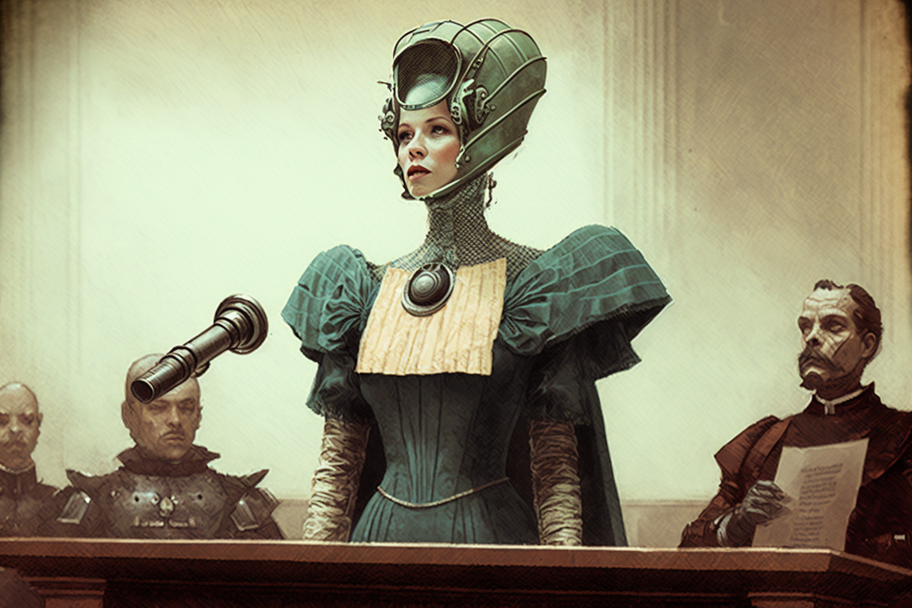

# Procurators

<figure><figcaption></figcaption></figure>

The pragmatic minds of Veel-Tark. Specialists in organisation, management and administration. They know social procedures and legal resources. They think with structure, act with judgement. And they solve efficiently.

### Jurists

Those who, being experts in matters of law, provide legal advice and perform the functions of legal philosophers, interpreting and expounding current legislation to create the legal framework of Veel-Tark. Those jurists who specifically focus on legal research to deal with city management and advice are warmly known as **Legal Rabbits**.

### Trustees

The Trustees are elected to look after the interests of Veel-Tark, especially in the economic and social spheres. Those who are in charge of administering money and economy are the **Treasurers**, while those who have social competences, resolving matters belonging to the internal organisation of the city, are the **Councillors**. Finally, those who assume powers or forms of entity representing the city, legally or diplomatically, are the **Heralds**.
