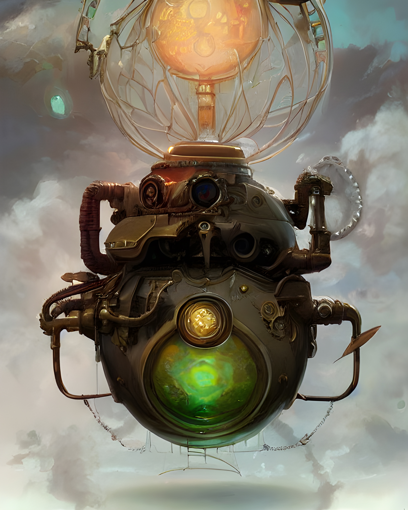

# Protogonic Dinasty

Description of the four breeds of the _**Protogonic Dynasty**_, the first great lineage of Khepris developed in the city of Veel-Tark.

## Genic breed: _<mark style="color:red;">Primordials</mark>_

The first reference to the Khepris of Veel-Tark alludes to the original colony of 55 Khepris discovered by the Oracles in the necropolis of Tuna el-Yebel, and which was generated by the perpetual activity of the gear machine of Athanasius, in the catacombs where it was hidden. They are known as the Primordial Khepris. With them begins the succession of the four races of the Protogonic Dynasty, linked to each other by genetic traits.

### Families of the _Primordials_.

#### <mark style="color:purple;">Tulpas</mark>

Perhaps the first to be gestated, together with the Egregors, by the incessant action of the gears of Athanasius, the Tulpas represent forms of emotional thought that, in their development, acquire autonomy and will of their own. They are, then, ideas that, because of their great significance, acquire life in a corporeal form. They have, then, an inverse correlation with the Egregoras, and are divided into three subfamilies:

**05** _Oneirics_. Intended for Oracles.

**05** _Selenics_. Intended for the Inner Circle.

**10** _Tellurics_. Intended for OGs.

#### <mark style="color:purple;">Egregors</mark>

Known as the Watchers or observers of time, the Egregors are individuals who project mental ideas and transform them into physical forms. They are, then, inversely correlative to the Tulpas, and, like them, are divided into three other subfamilies:

**15** _Warriors_. For early investors, priced at 1 ETH each.

**05** _Mystics_. Intended to reward the first adventure.

**05** _Pilgrims_. Intended for extraordinary contributions.

#### <mark style="color:purple;">Siddhis</mark>

Siddhis represent supernatural powers that have taken physical form. Magic is an intense and dynamic force in them, sometimes uncontrolled, so they are highly unstable specimens (their Attributes mutate assiduously, sometimes arbitrarily). They are divided into two subfamilies:

**05** _Lunars_. Intended for the first internal missions.

**05** _Solars_. Intended for the first external missions.

## **Coetaneous Breed: **_<mark style="color:red;">**Etherics**</mark>_

During the hundred years of silence of the city of Veel-Tark in the Akasha, two phenomena occurred almost simultaneously: the genesis of the Primordial Khepris, due to the activity of the machine of Athanasius, and a germinal action of another group of Khepris on the mental plane of the Akasha. The latter, of a virtual nature, are known as the Etheric Khepris. Strictly speaking, it is not certain that the Primordial Khepris are older than the Etherics, although, from their morphology, it seems very probable that the Ethereal Khepris germinated at a later stage.

## **First Evolution: **_<mark style="color:red;">**Chthonics**</mark>_

A new generation of Khepris was born in the early days of the rebirth of Veel-Tark, when the city still floated in a state of chaos and darkness after the hundred years of silence, from a process of biogenesis, in which nature took, spontaneously, the two previous groups as models to evolve. These new Khepris were recognized as the first evolution, and are called Chthonic Khepris. Emerging in that first moment of confusion of the shadows, their total number and all the characteristics of their morphology are still unknown, as some specimens may not have been discovered yet_<mark style="color:red;">.</mark>_

## **Second Evolution: **_<mark style="color:red;">**Luminous**</mark>_

At a later stage of the rebirth, when the Veel-Tark structure began to develop again, taking technological elements from the early days (time of the founding fathers) and merging them with the new technology, a new species of Khepris took shape, which constituted the second evolution. These more advanced specimens have already emerged in the light of new achievements and discoveries, so they are known as Luminous Khepris_<mark style="color:red;">.</mark>_
