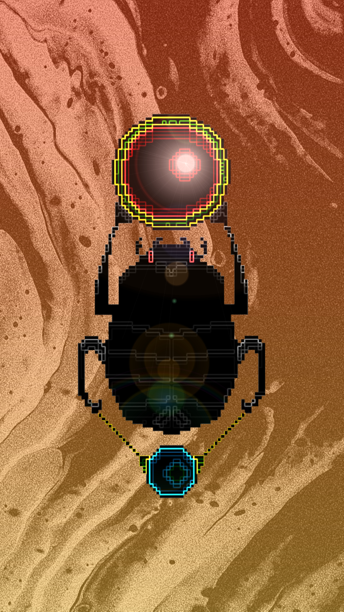

# The Independents

## **Protohistoric breed: **_<mark style="color:red;">**Antediluvians**</mark>_

Although this race is chronologically placed first, its existence was discovered later, after the generation of the four races of the Protogonic Dynasty. The Antediluvian Khepris are, then, a protohistoric race, devoid of dynasty, whose individuals were gestated in the annals of the mythical time that marks the calendars of the city of Veel-Tark. However, because they were discovered in a period later than the Protogonic Dynasty, their classification is established after those of the four races that make up that dynasty_<mark style="color:red;">.</mark>_
